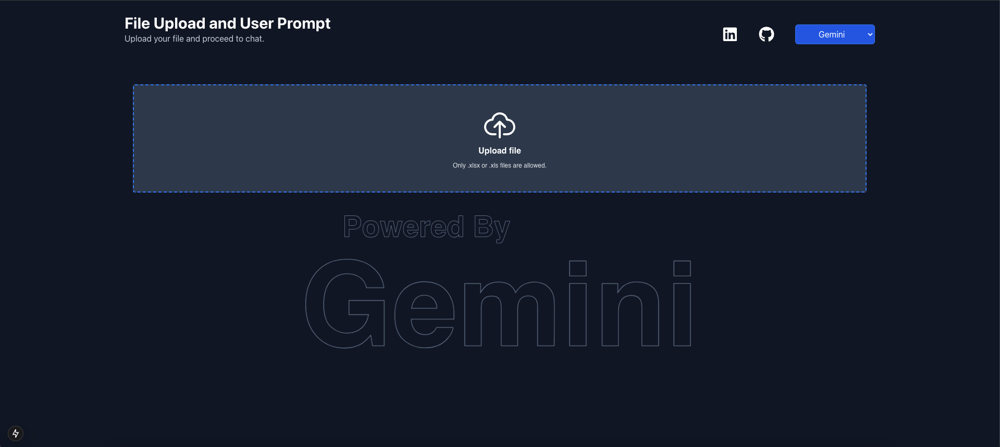
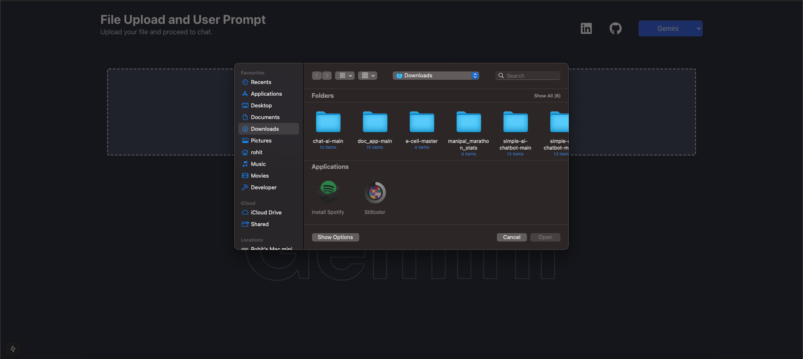
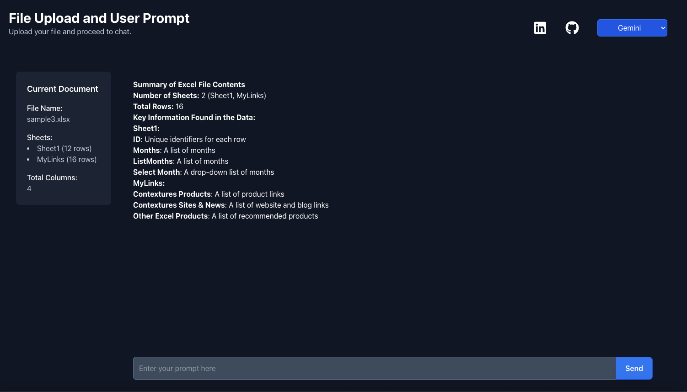
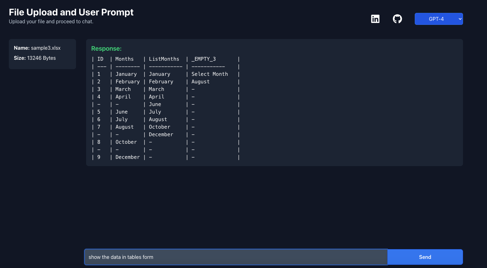

This is a [Next.js](https://nextjs.org) project bootstrapped with [`create-next-app`](https://github.com/vercel/next.js/tree/canary/packages/create-next-app).

## Getting Started

First, run the development server:

```bash
npm run dev
# or
yarn dev
# or
pnpm dev
# or
bun dev
```

Open [http://localhost:3000](http://localhost:3000) with your browser to see the result.

You can start editing the page by modifying `app/page.js`. The page auto-updates as you edit the file.

This project uses [`next/font`](https://nextjs.org/docs/app/building-your-application/optimizing/fonts) to automatically optimize and load [Geist](https://vercel.com/font), a new font family for Vercel.

---

## Learn More

To learn more about Next.js, take a look at the following resources:

- [Next.js Documentation](https://nextjs.org/docs) - learn about Next.js features and API.
- [Learn Next.js](https://nextjs.org/learn) - an interactive Next.js tutorial.

You can check out [the Next.js GitHub repository](https://github.com/vercel/next.js) - your feedback and contributions are welcome!

## Deploy on Vercel

The easiest way to deploy your Next.js app is to use the [Vercel Platform](https://vercel.com/new?utm_medium=default-template&filter=next.js&utm_source=create-next-app&utm_campaign=create-next-app-readme) from the creators of Next.js.

Check out our [Next.js deployment documentation](https://nextjs.org/docs/app/building-your-application/deploying) for more details.

---

# Features

- **File Upload & Analysis**: Users can upload **XLSX files** (Excel spreadsheets), which are then processed and analyzed using the selected LLM (GPT-4 or Gemini). The content of the file, including data, columns, and sheets, is extracted and summarized for the user.
  
- **Two Methods of Chat**:
  - **GPT-4**: Uses a **single-answer approach** to respond to user queries. The user submits a question, and GPT-4 provides a comprehensive, single response, ideal for quick insights or concise answers.
  - **Gemini**: Implements a **chat-based Q&A** format. Users can engage in a back-and-forth conversation, asking multiple questions, and receiving contextually aware responses that build on previous interactions. This method is suitable for more detailed and interactive dialogues.

With these features, users can easily analyze Excel data and interact with two of the most advanced LLMs available, tailored to their preferences.

---

### The app demonstrates the integration of two LLMs: GPT-4 and Gemini

This project integrates two powerful language models, **GPT-4** from OpenAI and **Gemini** from Google. These models allow the application to perform advanced natural language processing tasks, such as document summarization, question answering, and content generation.

- **GPT-4**: A highly advanced language model developed by OpenAI. GPT-4 excels at understanding and generating human-like text, and can be applied to a wide range of tasks, from answering complex questions to creative writing.
  - **Link to OpenAI API**: [OpenAI API](https://platform.openai.com/docs)
  - **Link to GPT-4 Documentation**: [GPT-4 Overview](https://openai.com/research/gpt-4)

- **Gemini**: Google's advanced language model, part of the Gemini family. It is built to provide high-quality text generation capabilities, and can be used for tasks similar to GPT-4 but with Google's proprietary enhancements.
  - **Link to Gemini API Documentation**: [Google Generative AI](https://developers.google.com/generative-ai)

By integrating these models, the app can provide users with intelligent document analysis, extract insights, and even generate helpful visualizations based on input data.

---
This project allows seamless interaction with both models, providing a versatile tool for analyzing and processing documents and other types of content.

---
# Usage Instructions

Follow these steps to upload and interact with the AI using an `.xlsx` file.

## Steps:

1. **Select the Model:**
   - Choose the LLM (Language Model) of your choice from the dropdown menu.

2. **Upload the File:**
   - Click on the "Select File" button and choose your `.xlsx` file.

3. **Automatic Upload:**
   - Once the file is selected, it will be uploaded automatically.

4. **Start the Conversation:**
   - After the file upload, you can chat with the AI about the contents of the document.

5. **Please wait if it loads:**
   - Depending upon the internet speed and other factors, the app might take longer than usual to return a response, Kindly be patient and allow to generate the response. If the response fails, resend the the prompt.

---

## Folder Structure

```
.
├── .next 
│   (Generated by Next.js, contains compiled code)
├── app 
│   ├── aceternity 
│       (Folder containing code related to the Aceternity project)
│   ├── api 
│       (Folder containing API endpoints)
│   │   ├── Components 
│   │   │   (Folder containing API-related components)
│   │   │   ├── Gemini 
│   │   │   │   (Folder for Gemini-specific API components)
│   │   │   ├── FileUpload.jsx 
│   │   │   │   (React component for handling file uploads)
│   │   │   └── Header.jsx 
│   │   │   │   (React component for the API header)
│   │   └── services 
│   │       ├── excel.js 
│   │       │   (Utility functions for working with Excel data)
│   │       └── gemini.js 
│   │       │   (Utility functions for interacting with the Gemini AI model)
│   └── services 
│       ├── excel.js 
│           (Utility functions for working with Excel data)
│       └── gemini.js 
│           (Utility functions for interacting with the Gemini AI model)
├── favicon.ico 
│   (The browser tab icon)
├── globals.css 
│   (Global CSS styles for the application)
├── layout.js 
│   (The layout component that defines the page structure)
├── lib 
│   (Folder containing utility functions and libraries)
│   └── utils.js 
│       (Utility functions for general use)
├── node_modules 
│   (Contains all project dependencies)
├── env 
│   (Folder containing environment variables)
├── .gitignore 
│   (Specifies files and directories to ignore in Git)
├── eslint.config.mjs 
│   (Configuration file for ESLint, a JavaScript linter)
├── jsconfig.json 
│   (Configuration file for JavaScript language features in VS Code)
├── next.config.mjs 
│   (Configuration file for Next.js)
├── package-lock.json 
│   (Locks down dependency versions for consistent builds)
├── package.json 
│   (Project metadata, including dependencies and scripts)
├── postcss.config.mjs 
│   (Configuration file for PostCSS, a CSS transformer)
├── README.md 
│   (Project documentation)
└── tailwind.config.mjs 
│   (Configuration file for Tailwind CSS, a utility-first CSS framework)
```
---

## Libraries

#### The project utilizes the following React libraries:

- **clsx**: `^2.1.1`
- **dotenv**: `^16.4.7`
- **framer-motion**: `^12.0.3`
- **marked**: `^15.0.6`
- **motion**: `^12.0.4`
- **next-themes**: `^0.4.4`
- **openai**: `^4.80.0`
- **react**: `^19.0.0`
- **react-dropzone**: `^14.3.5`
- **react-icons**: `^5.4.0`
- **react-toastify**: `^11.0.3`

---
## Screenshot

Here is a screenshot of the app:







